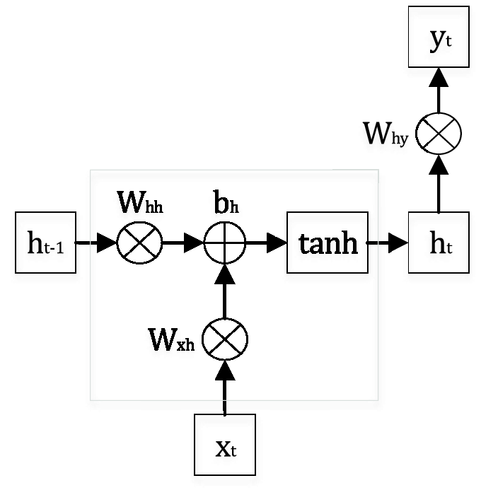
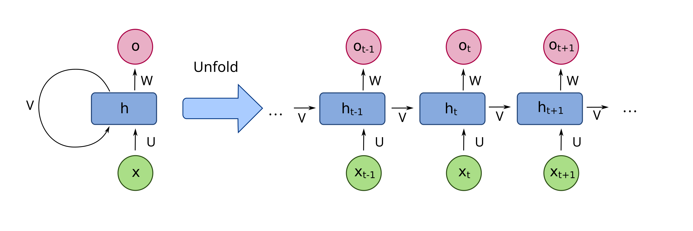
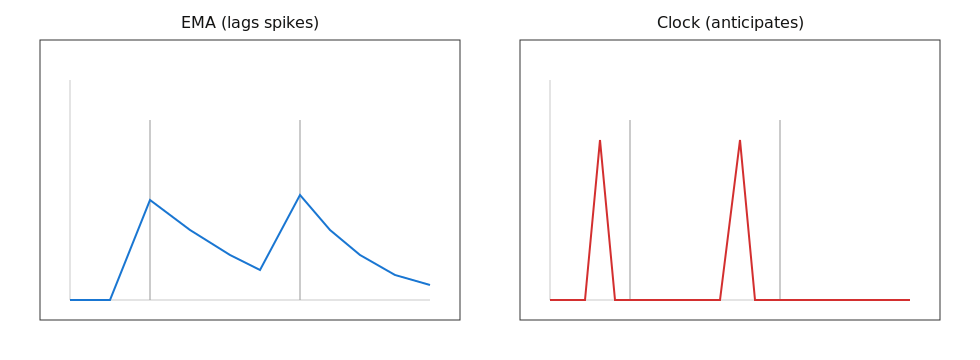

```{r setup, include=FALSE}
knitr::opts_chunk$set(echo = TRUE, eval = FALSE)
```


* Feedforward Neural Networks (FFNNs)
    * Treat each input independently; they do not consider the order or context of inputs.
    * Works on fixed-size, static inputs.
    * Fast to train and simple.
    * Cannot model sequences or temporal dependencies.
    * Use cases: tabular data, single-image classification.

* Convolutional Neural Networks (CNNs)
    * Detects local spatial/temporal patterns using filters.
    * Good for grid-like or structured data (images, short sequences).
    * Good for short-term dependencies (e.g. local trends) but struggle with long-term dependencies such as yearly seasonality.
    * Highly parallelizable
    * Use cases: images, short-term time series, audio feature extraction.

* Recurrent Neural Networks (RNNs)
    * Maintains a hidden state (memory) that evolves over time $\to$ allowing predictions to depend on the entire history of inputs seen so far.
    * Designed for sequential and time-dependent data.
    * Harder to parallelize; vanilla RNNs suffer from vanishing/exploding gradients.
    * Use cases: language modeling, translation, speech recognition, forecasting, anomaly detection.

# Recurrent Neural Networks (RNNs)

## Mathematical Foundation

The core RNN equations define how information flows through time:

$$\begin{aligned}
h_t &= f\!\left(W_{xh}x_t + W_{hh}h_{t-1} + b_h\right) \\
y_t \ \text{or}\ \hat{x}_{t+1} &= g\!\left(W_{hy}h_t + b_y\right)
\end{aligned}$$

- $W_{xh} \in \mathbb{R}^{d_h\times d_x}$: Input-to-hidden weight matrix - determines how the current input $x_{t}$ affects the hidden state.
- $W_{hh} \in \mathbb{R}^{d_h\times d_h}$: Hidden-to-hidden weight matrix - controls how information from the past is retained ("memory").
- $W_{hy} \in \mathbb{R}^{d_y\times d_h}$: Hidden-to-output weight matrix - converts the hidden state to output/predictions
- $f(\cdot)$: Activation function (typically tanh or ReLU)
- $g(\cdot)$: Output activation (depends on task: linear for regression, softmax for classification)

**Forecasting Convention**: For time series prediction, we use $\hat{x}_{t+1} = g(W_{hy}h_t + b_y)$ to predict the next value in the sequence.

### Single RNN Cell Architecture

The internal structure of a single RNN cell at time step t:

```{r}

```


* Input: $x_t$ (current time step input)
* Previous hidden state: $h_{t-1}$ (memory from previous time step)
* Current hidden state: $h_t$ (output of current cell)
* Final output: $y_t$ (prediction or output at time t)


Operations:

1. $W_{xh} \otimes x_t$: Input transformation - the input $x_t$ is multiplied by weight matrix $W_{xh}$
2. $W_{hh} \otimes h_{t-1}$: Hidden state transformation - previous hidden state $h_{t-1}$ is multiplied by recurrent weight matrix $W_{hh}$
3. $+ b_h$: Bias addition - bias term is added to the sum
4. tanh: Activation function applied to create new hidden state $h_t$
5. $W_{hy} \otimes h_t$: Output transformation - hidden state is transformed to produce output $y_t$

Mathematical representation:

$h_t = tanh(W_xh * x_t + W_hh * h_{t-1} + b_h)$
$y_t = W_hy * h_t$

The gray box emphasizes the core recurrent computation that creates the memory mechanism.

### RNN block unfolded through time

RNN block unfolded through time, revealing the sequential computation:

```{r}

```

Left side (Folded):

* Shows the compact representation with the recurrent loop
* The circular arrow represents the temporal connection
* Parameters U, V, W represent the weight matrices

Right side (Unfolded):

* Shows the same network expanded across time steps: t−1, t, t+1, etc.
* Each blue box represents the same RNN cell applied at different time steps
* Key insight: The same parameters (U, V, W) are shared across all time steps

Information flow:

* Horizontal arrows: Hidden states flowing forward in time $h_{t-1} \to h_t \to h_{t+1}$
* Upward arrows: Outputs at each time step $o_{t-1}, o_t, o_{t+1}$
* Input connections: Each time step receives its own input $x_{t-1}, x_t, x_{t+1}$

Why unfolding matters:

* Training: Backpropagation through time (BPTT) operates on this unfolded graph
* Memory: Shows how information can flow across multiple time steps
* Parameter sharing: Demonstrates that the same weights are used at every time step
* Sequential processing: Illustrates the inherent sequential nature of RNN computation


## Hidden-to-Hidden Matrix $W_{hh}$ 

The eigenvalues $\lambda_i$ of $W_{hh}$ control how past states $h_0$ affect $h_t$ over time.

- Small eigenvalues ($|\lambda| < 1$) $\to$ memory fades quickly; past inputs have little influence.
- Eigenvalues near 1 $\to$ information persists, like a clock or moving average.
- Rotational matrices (eigenvalues on unit circle) $\to$ produce oscillations or periodic patterns.
- Large eigenvalues ($|\lambda| > 1$) $\to$ risk of exploding states, causing instability in training.
- Properly chosen $W_{hh}$ can capture temporal patterns: decays, cycles, or oscillations.


## Simple numerical example

* State update (simplified, no bias or activation): $h_t = W_{hh}h_{t-1} + W_{xh}x_t$
* One step ahead forecast: $\hat{x}_{t+1} = W_{hy}h_t$
* Consider scalar input/output $x_t$, $\hat{x}_{t+1}$, hidden state $h_t \in \mathbb{R}^2$:
* Matrix sizes: $W_{xh}$ is $2\times 1$, $W_{hh}$ is $2\times 2$, $W_{hy}$ is $1\times 2$.


## (a) Weighted Moving Average 

$$W_{hh}=\begin{bmatrix}0.75 & 0\\ 0 & 0\end{bmatrix},\quad
W_{xh}=\begin{bmatrix}0.25\\ 0\end{bmatrix},\quad
W_{hy}=\begin{bmatrix}1 & 0\end{bmatrix}.$$

Then 

- $h_{t,1} = 0.75\,h_{t-1,1} + 0.25\,x_t$ (exponential smoothing with $\alpha$ = 0.25)
- $h_{t,2} = 0$ (unused dimension)
- $\hat{x}_{t+1} = h_{t,1}$ (direct readout of smoothed state)

This creates a classic exponential moving average with decay factor 0.75, commonly used in financial analysis and signal processing.

  
## (a) Weighted Moving Average via RNN

Input sequence $x = [0,0,0,5,0,0,0,5,0]$, with initial state $h_0=[0,0]^\top$.


| $t$ | $x_t$ | $h_t^\top$ | $\hat{x}_{t+1}$ | Interpretation |
|---:|---:|---|---:|---|
| 1 | 0 | $[0.000,\ 0.000]$ | $0.0000$ | No signal yet |
| 2 | 0 | $[0.000,\ 0.000]$ | $0.0000$ | Still quiet |
| 3 | 0 | $[0.000,\ 0.000]$ | $0.0000$ | Baseline |
| 4 | 5 | $[1.250,\ 0.000]$ | $\mathbf{1.2500}$ | **Spike detected, predicting echo** |
| 5 | 0 | $[0.9375,\ 0.000]$ | $0.9375$ | Exponential decay begins |
| 6 | 0 | $[0.7031,\ 0.000]$ | $0.7031$ | Continued decay |
| 7 | 0 | $[0.5273,\ 0.000]$ | $0.5273$ | Memory fading |
| 8 | 5 | $[1.6455,\ 0.000]$ | $\mathbf{1.6455}$ | **Second spike, stronger prediction** |
| 9 | 0 | $[1.2341,\ 0.000]$ | $1.2341$ | New decay cycle |


The weighted movinf average provides a reactive forecasting approach, predicting based on recent weighted history.


## (b) 4-Step Cycle 

$$W_{hh}=\begin{bmatrix}0 & -1\\ 1 & 0\end{bmatrix},\quad
W_{xh}=\begin{bmatrix}1/5\\ 0\end{bmatrix},\quad
W_{hy}=\begin{bmatrix}0 & -5\end{bmatrix}.$$

Then 

- $h_{t,1} = -\,h_{t-1,2} + \tfrac{1}{5} x_t$
- $h_{t,2} = h_{t-1,1}$
- $\hat{x}_{t+1} = W_{hy}\,h_t = -5\,h_{t,2}$

Rotates the hidden state $90^\circ$ each step $\to$ generates periodic behavior.

## (b) 4-Step Cycle 

Inputs $x=[0,0,0,5,\,0,0,0,5,\,0]$. Initialize $h_0=[1,0]^\top$. 

| $t$ | $x_t$ | $h_t^\top$ | $\hat{x}_{t+1}$ | **Phase** |
|---:|---:|---|---:|---|
| 1 | 0 | $[0,\ 1]$ | $-5.0$ | 90° |
| 2 | 0 | $[-1,\ 0]$ | $0.0$ | 180° |
| **3** | 0 | $[0,\ \mathbf{-1}]$ | **$\mathbf{5.0}$** | **270° - Prediction phase** |
| 4 | 5 | $[2,\ 0]$ | $0.0$ | 0° (reset + input) |
| 5 | 0 | $[0,\ 2]$ | $-10.0$ | 90° |
| 6 | 0 | $[-2,\ 0]$ | $0.0$ | 180° |
| **7** | 0 | $[0,\ \mathbf{-2}]$ | **$\mathbf{10.0}$** | **270° - Prediction phase** |
| 8 | 5 | $[3,\ 0]$ | $0.0$ | 0° (reset + input) |

 

- $W_{hh}$ rotates by $90^\circ$ each step (period 4). 
- Spike inputs to **re-sync** phase 
- Output reads pre-spike phase
- Linear readout gives a sinusoidal score; gates/thresholds would help remove the bottom trough.


## (c) 12-Step Cycle 

$$
W_{hh}=\begin{bmatrix}\cos 30^\circ & -\sin 30^\circ\\ \sin 30^\circ & \cos 30^\circ\end{bmatrix},\quad
W_{xh}=\begin{bmatrix}1/5\\ 0\end{bmatrix},\quad
W_{hy}=\begin{bmatrix}\cos 330^\circ & \sin 330^\circ\end{bmatrix}.
$$

Then

- $h_{t,1} = \cos 30^\circ \, h_{t-1,1} \;-\; \sin 30^\circ \, h_{t-1,2} \;+\; \tfrac{1}{5}\,x_t$
- $h_{t,2} = \sin 30^\circ \, h_{t-1,1} \;+\; \cos 30^\circ \, h_{t-1,2}$
- $s_t = W_{hy} h_t \;=\; \cos 330^\circ \, h_{t,1} \;+\; \sin 330^\circ \, h_{t,2}$
- $\hat{x}_{t+1} = g(s_t), \quad g(s) = \max(0, 100\,(s-0.95))$


## (c) 12-Step Cycle 

| t | phase | $h_t$ | $W_{hy}h_t$ | $\hat{x}_{t+1}$ |
|---:|:--------------:|:---------------------------:|:---------------:|:----------------:|
| 0  | $0^\circ$   | [1.000, 0.000]   | 0.866 | 0.0 |
| 1  | $30^\circ$  | [0.866, 0.500]   | 0.500 | 0.0 |
| 2  | $60^\circ$  | [0.500, 0.866]   | 0.000 | 0.0 |
| 3  | $90^\circ$  | [0.000, 1.000]   | −0.500| 0.0 |
| 4  | $120^\circ$ | [−0.500, 0.866] | −0.866| 0.0 |
| 5  | $150^\circ$ | [−0.866, 0.500] | −1.000| 0.0 |
| 6  | $180^\circ$ | [−1.000, 0.000] | −0.866| 0.0 |
| 7  | $210^\circ$ | [−0.866, −0.500]| −0.500| 0.0 |
| 8  | $240^\circ$ | [−0.500, −0.866]| 0.000 | 0.0 |
| 9  | $270^\circ$ | [0.000, −1.000] | 0.500 | 0.0 |
| 10 | $300^\circ$ | [0.500, −0.866] | 0.866 | 0.0 |
| 11 | $330^\circ$ | [**0.866, −0.500**] | **1.000** | **5.0** |
| 12 | $360^\circ$ | [1.000, 0.000] | 0.866 | 0.0 |


- The hidden state rotates steadily around the unit circle.  
- The raw score $s_t=W_{hy}h_t$ is just a cosine wave, peaking when $h_t$ reaches the pre-spike phase (330°).  
- The nonlinearity $g(s)$ converts this smooth score into a sharp forecast spike at $t=11$.  
- At $t=12$, the observed spike resets the hidden state to $[1,0]^T$, ready for the next cycle.


## EMA vs Clock

{fig-cap="EMA baseline vs. phase-tracking clock (anticipatory)"}

* EMA captures decaying average of past inputs.
* Clock/oscillator approach anticipates periodic events by tracking phase.


# Training RNNs

## Backpropagation Through Time (BPTT)

Idea: Unroll the RNN across all timesteps and apply standard backpropagation.

For sequence of length $T$, loss $L=\sum_{t=1}^T \ell_t$, 

$$
\frac{\partial L}{\partial \theta} \;=\; \sum_{t=1}^T \frac{\partial L}{\partial h_t}\frac{\partial h_t}{\partial \theta}
\quad\text{with}\quad
\frac{\partial L}{\partial h_{t-1}} \;=\; \frac{\partial L}{\partial h_t}\, \underbrace{\frac{\partial h_t}{\partial h_{t-1}}}_{J_t}.
$$

- $J_t = \partial h_t/\partial h_{t-1}$ controls gradient flow across time.  
- Over $k$ steps, gradients accumulate products $J_t J_{t-1}\cdots J_{t-k+1}$.
- If $\|J_t\|\approx \lambda$, then across $k$ steps the product scales as $\lambda^k$.
- Gives rise to problem of exploding or vanishing gradients


- Vanishing: $\lambda = 0.9 \Rightarrow 0.9^{50}\approx 0.005$, so early timesteps contribute almost nothing.  
- Exploding: $\lambda = 1.1 \Rightarrow 1.1^{50}\approx 117$, so unstable updates.
- Other kinds of RNN units (LSTM/GRU) help avoid this by "gating"


## LSTM

$$
\begin{aligned}
i_t &= \sigma(W_{xi}x_t + W_{hi}h_{t-1} + b_i) \\
f_t &= \sigma(W_{xf}x_t + W_{hf}h_{t-1} + b_f) \\
o_t &= \sigma(W_{xo}x_t + W_{ho}h_{t-1} + b_o) \\
\tilde{c}_t &= \tanh(W_{xc}x_t + W_{hc}h_{t-1} + b_c) \\
c_t &= f_t \odot c_{t-1} + i_t \odot \tilde{c}_t \\
h_t &= o_t \odot \tanh(c_t)
\end{aligned}
$$

Input gate $i_t$, forget gate $f_t$, output gate $o_t$.

$$
\begin{aligned}
c_t &= f_t \odot c_{t-1} + i_t \odot \tilde{c}_t \\
h_t &= o_t \odot \tanh(c_t)
\end{aligned}
$$

An LSTM has **two hidden vectors** at each step:  

- $h_t$: the hidden state / output  
- $c_t$: the cell state / long-term memory track

$$
\begin{aligned}
c_t &= f_t \odot c_{t-1} + i_t \odot \tilde{c}_t \\
h_t &= o_t \odot \tanh(c_t)
\end{aligned}
$$

- $i_t$ controls how much of $\tilde{c}_t$ is allowed into $c_t$.
- $f_t$ controls how much of $c_{t-1}$ is retained vs. discarded.
- $o_t$ controls how much of $\tanh(c_t)$ is retained.


### The Forget Gate

$f_t$ controls how much of $c_{t-1}$ is carried forward.

$$f_t = \sigma(W_{xf}x_t + W_{hf}h_{t-1} + b_f)$$

- $W_{xf}$: how current input $x_t$ influences forgetting.  
- $W_{hf}$: how past hidden state $h_{t-1}$ influences forgetting.  
- $\sigma(\cdot)$ squashes values into $[0,1]$.  

- $f_{t,i} \approx 1$: keep the $i$-th cell’s past memory.  
- $f_{t,i} \approx 0$: forget (wipe out) the $i$-th cell’s past memory.  


### The Input Gate

$i_t$ controls how much of $\tilde{c}_t$ to admit.

$$
\begin{aligned}
i_t & = \sigma(W_{xi}x_t + W_{hi}h_{t-1} + b_i) \\
\tilde{c}_t &= \tanh(W_{xc}x_t + W_{hc}h_{t-1} + b_c)
\end{aligned}
$$

- $W_{xi}, W_{hi}$: decide where new info should be written.  
- $W_{xc}, W_{hc}$: transform input and hidden state into a candidate content vector.  


### Updating the Cell State

Now combine forget and input:

$$
c_t = f_t \odot c_{t-1} + i_t \odot \tilde{c}_t
$$

This equation is the core of the LSTM:

- $f_t \odot c_{t-1}$ carries over past memory where $f_t$ says so.  
- $i_t \odot \tilde{c}_t$ adds new content where $i_t$ allows.  
Updating $c_t$ is updated by addition rather than full replacement avoids vanishing/exploding gradients.


### The Output Gate

$o_t$ decides how much of $c_t$ is exposed. 

$$
\begin{aligned}
o_t &= \sigma(W_{xo}x_t + W_{ho}h_{t-1} + b_o) \\
h_t &= o_t \odot \tanh(c_t)
\end{aligned}
$$

- $\tanh(c_t)$ squashes the cell state to $[-1,1]$ before exposing.  
- $h_t$ is then fed forward to the next step.


## Summary

At each time step:

1. Forget gate ($f_t$) decides what old info to erase.  
2. Input gate ($i_t$ + $\tilde{c}_t$) decides what new info to add.  
3. Cell state update combines old and new: $c_t = f_t \odot c_{t-1} + i_t \odot \tilde{c}_t$.
4. Output gate ($o_t$) decides what part of $c_t$ becomes visible in $h_t$.


## Gated Recurrent Units (GRUs)

$$
\begin{aligned}
z_t &= \sigma(W_{xz}x_t + W_{hz}h_{t-1} + b_z) \quad\text{(update)}\\
r_t &= \sigma(W_{xr}x_t + W_{hr}h_{t-1} + b_r) \quad\text{(reset)}\\
\tilde{h}_t &= \tanh\big(W_{xh}x_t + W_{hh}(r_t \odot h_{t-1}) + b_h\big) \\
h_t &= (1 - z_t)\odot \tilde{h}_t + z_t \odot h_{t-1}
\end{aligned}
$$

- one hidden vector $h_t$ (no separate cell state).  
- "reset gate" $r_t$ and "update gate" $z_t$.

$$h_t = (1 - z_t)\odot \tilde{h}_t + z_t \odot h_{t-1}$$

- $z_t$ blends old vs new (acts like $f_t$/$i_t$ combo).
- If $z_t \approx 1$: keep old $h_{t-1}$.  
- If $z_t \approx 0$: replace with candidate $\tilde{h}_t$.  


### The Update Gate

$$
z_t = \sigma(W_{xz}x_t + W_{hz}h_{t-1} + b_z)
$$

- $W_{xz}$: how current input $x_t$ influences whether to keep old memory.  
- $W_{hz}$: how past hidden state $h_{t-1}$ influences this decision.  
- $\sigma(\cdot)$ gives values in $[0,1]$.  
- $z_{t,i} \approx 1$: keep the $i$-th unit from the past.  
- $z_{t,i} \approx 0$: replace it with a new candidate.  


### The Reset Gate

$\tilde{h}_t$ is the **new candidate hidden state** the GRU could switch to:

$$
\tilde{h}_t = \tanh\!\big(W_{xh}x_t + W_{hh}(r_t \odot h_{t-1}) + b_h\big)
$$

with 

$$r_t = \sigma(W_{xr}x_t + W_{hr}h_{t-1} + b_r)$$

controlling how much the past hidden state contributes when making a new candidate.  

## The Reset Gate

$$
\begin{aligned}
\tilde{h}_t = \tanh\!\big(W_{xh}x_t + W_{hh}(r_t \odot h_{t-1}) + b_h\big)
r_t = \sigma(W_{xr}x_t + W_{hr}h_{t-1} + b_r)
\end{aligned}
$$

- $W_{xr}, W_{hr}$: decide where new info should be written.  
- $W_{xh}, W_{hh}$: transform input and (reset version of last) hidden state into a candidate content vector.  
- $r_{t,i} \approx 0$: ignore the $i$-th unit of $h_{t-1}$ when building the candidate.  
- $r_{t,i} \approx 1$: fully use the past hidden info.


## Summary

- Update gate $z_t$ weighs old memory vs. new memory,
- Reset gate $r_t$ weighs past info when making a new memory, 
- $\tilde{h}_t$ is the proposed new memory, 


# RNN Time Series Forecasting with Keras 

This code demonstrates how to build and compare different RNN architectures (SimpleRNN, LSTM, GRU) for time series forecasting using Keras in R. The task involves predicting periodic spikes in a synthetic time series.

## 1. Setup and Data Generation

```{r, eval = FALSE}
library(keras3)
set.seed(42)
N <- 600
period <- 12

spikes <- rep(c(rep(0, period-1), 5), length.out = N)
noise <- rnorm(N, sd = 0.2)
series <- spikes + noise
```

Purpose: Create a synthetic periodic time series with predictable patterns.

Components:

- `N <- 600`: Generate 600 time points
- `period <- 12`: Set periodicity to 12 time steps (like monthly data)
- `spikes <- rep(c(rep(0, period-1), 5), length.out = N)`: 
  - Creates pattern: `[0,0,0,0,0,0,0,0,0,0,0,5]` repeated for 600 points
  - Spike of magnitude 5 every 12th time step
- `noise <- rnorm(N, sd = 0.2)`: Add Gaussian noise with standard deviation 0.2
- `series <- spikes + noise`: Combine clean periodic signal with noise

Result: A noisy time series with spikes at positions 12, 24, 36, 48, etc.

## 2. Data Preprocessing for Supervised Learning

```{r, eval = FALSE}
Twin <- 24
X <- array(0, dim = c(N - Twin, Twin, 1))
y <- array(0, dim = c(N - Twin, 1))

for (i in seq_len(N - Twin)) {
  X[i,,1] <- series[i:(i+Twin-1)]
  y[i,1]  <- series[i+Twin]
}
```

Purpose: Transform the time series into a supervised learning problem using a sliding window approach.

Parameters:

- `Twin <- 24`: Window size of 24 time steps (input sequence length)
- `X`: Input array with dimensions `[samples, timesteps, features]`
  - `samples`: N - Twin = 576 training examples
  - `timesteps`: 24 (lookback window)
  - `features`: 1 (univariate time series)
- `y`: Output array with dimensions `[samples, outputs]`

Sliding Window Logic:

- For each position `i`, use 24 consecutive values as input: `series[i:(i+23)]`
- Predict the next value: `series[i+24]`
- Example:
    - Sample 1: X = series[1:24], y = series[25]
    - Sample 2: X = series[2:25], y = series[26]
    - And so on...

Result: 576 input-output pairs suitable for training RNNs.

## 3. Model Architecture 1: SimpleRNN (EMA-like Baseline)

```{r}
inputs <- layer_input(shape = c(Twin, 1))
rnn <- layer_simple_rnn(inputs, units = 2, activation = "tanh")
outputs <- layer_dense(rnn, units = 1, activation = "linear")
model_ema <- keras_model(inputs, outputs)
```

Architecture:

- Input Layer: Accepts sequences of shape `(24, 1)`
- SimpleRNN Layer: 
    - `units = 2`: Only 2 hidden units (minimal capacity)
    - `activation = "tanh"`: Standard RNN activation
    - `return_sequences = FALSE` (default): Returns only the last hidden state
- Dense Output Layer: 
    - `units = 1`: Single output for next value prediction
    - `activation = "linear"`: No activation for regression

Purpose: Serves as a baseline that mimics exponential moving average behavior due to limited capacity.

## 4. Model Architecture 2: LSTM Forecaster

```{r}
inputs <- layer_input(shape = c(Twin, 1))
lstm <- layer_lstm(inputs, units = 16, return_sequences = FALSE)
outputs <- layer_dense(lstm, units = 1)
model_lstm <- keras_model(inputs, outputs)
```

Architecture:

- Input Layer: Same shape `(24, 1)`
- LSTM Layer:
    - `units = 16`: 16 LSTM cells (8x more capacity than SimpleRNN)
    - `return_sequences = FALSE`: Return only final hidden state
    - Includes forget, input, and output gates for better memory control
- Dense Output Layer: Linear output for regression

Purpose: Leverage LSTM's gating mechanisms to capture long-term dependencies and periodic patterns.

## 5. Model Architecture 3: GRU Forecaster

```{r}
inputs <- layer_input(shape = c(Twin, 1))
gru <- layer_gru(inputs, units = 16, return_sequences = FALSE)
outputs <- layer_dense(gru, units = 1)
model_gru <- keras_model(inputs, outputs)
```

Architecture:

- Input Layer: Same shape (24, 1)
- GRU Layer:
  - `units = 16`: 16 GRU cells (same capacity as LSTM)
  - `return_sequences = FALSE`: Return only final hidden state
  - Uses update and reset gates (simpler than LSTM)
- Dense Output Layer: Linear output for regression

Purpose: Test whether GRU's simpler gating mechanism can match LSTM performance with fewer parameters.

## 6. Model Compilation

```{r}
model_ema %>% compile(
  optimizer = optimizer_adam(learning_rate = 1e-3, clipnorm = 1.0),
  loss = "mse", metrics = "mae")
```

Training Configuration (same for all models):

- Optimizer: Adam with learning rate 0.001
- Gradient Clipping: `clipnorm = 1.0` prevents exploding gradients
- Loss Function: Mean Squared Error (MSE) for regression
- Metrics: Mean Absolute Error (MAE) for interpretable performance tracking

Why Gradient Clipping? RNNs are prone to exploding gradients, especially during early training. Clipping ensures stable updates.

## 7. Model Evaluation and Visualization

```{r}
pred_ema <- model_ema  %>% predict(X)
pred_lstm <- model_lstm %>% predict(X)
pred_gru <- model_gru  %>% predict(X)

plot_idx <- 1:200
plot(y[plot_idx,1], type="l", col="black", lwd=2, main="Validation forecasts")
lines(pred_ema[plot_idx,1],  col="steelblue", lwd=2)
lines(pred_lstm[plot_idx,1], col="tomato", lwd=2)
lines(pred_gru[plot_idx,1],  col="darkgreen", lwd=2)
legend("topleft", legend=c("true","EMA","LSTM","GRU"),
       col=c("black","steelblue","tomato","darkgreen"), lwd=2, bty="n")
```


Anticipated Performance:

- SimpleRNN (EMA): Likely to provide smoothed, reactive forecasts
- LSTM: Should capture the 12-step periodicity and provide anticipatory predictions
- GRU: Expected to perform similarly to LSTM with potentially faster training

Key Learning Points:

1. Capacity Matters: The 2-unit SimpleRNN has limited representational power
2. Memory Mechanisms: LSTM/GRU gates help retain information about the 12-step cycle
3. Anticipatory vs. Reactive: Advanced architectures can predict spikes before they occur
4. Gradient Stability: Clipping ensures stable training across all architectures


